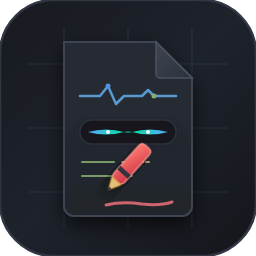

<div align="center">



# Stealth PDF Viewer
### 工位摸鱼考公刷题神器 · 极致隐蔽做题批注查看器
**Stealth PDF & Exam Practice Editor for VS Code & Web**

[](https://code.visualstudio.com/)
[](https://github.com/xiaomu1110/stealth-pdf-viewer/releases)
[]()
[]()
[](LICENSE)

[**🇨🇳 中文说明**](#-中文说明) &nbsp;|&nbsp; [**🇺🇸 English Guide**](#-english-guide)

</div>

---

<a name="-中文说明"></a>
# 🇨🇳 中文说明

> **专为工位打工人、备考公考 / 考研 / 考证设计的极致隐蔽 PDF 做题与涂鸦批注器。**  
> 深度融入 VS Code，编辑区零可疑 UI，双向真实源码老板键，深色代码黑防窥，多层防丢笔迹存储，百页长题册极速保存。

---

## 🖼️ 界面示意图与交互架构

### 1. 编辑区零暴露 UI (沉浸式融入开发环境)
所有控制操作**全量融入 VS Code 右下角状态栏**，编辑区完全没有任何网页顶栏、浮动工具球或绘图准星：

```text
┌─────────────────────────────────────────────────────────────────────────────┐
│ Explorer  │ service_metrics.go  │ 📄 2026行测真题题册.pdf ✕                  │
├───────────┴─────────────────────┴───────────────────────────────────────────┤
│                                                                             │
│   14. 某项工程由甲单独做需15天完成，由乙单独做需20天完成……                    │
│       A. 12       B. 10       C. 8 (✔)       D. 6                           │
│       ~~~~~~~~~~~~~~~~~~~~~~~~                                              │
│       [红笔作答、荧光笔划重点，支持 1px 细线，原生系统鼠标指针]                   │
│                                                                             │
│                                                                             │
├─────────────────────────────────────────────────────────────────────────────┤
│ >_ Terminal | Output | Debug                                                │
├─────────────────────────────────────────────────────────────────────────────┤
│ ⎇ main* │ ⊘ 0 ⚠ 0 │ [笔] | [荧光] | [擦] | 🔴红 | 2px | 代码黑 | 存 | 📄 12/180 │
└─────────────────────────────────────────────────────────────────────────────┘
  ↑ 开发状态指标        ↑ 题册控制按钮完美混杂在状态栏中，切到代码页时全自动隐匿 ↑
```

---

### 2. 双向真实代码老板键 (`Esc` / `` ` ``)
紧急时刻按下 `Esc`，秒切工作区真实工程源码；再按 `Esc` 瞬切回题册并恢复阅读位置与画笔。

```text
       ┌────────────────────────┐                   ┌────────────────────────┐
       │     考公 / 刷题页面    │                   │   真实业务代码文档     │
       │   (Stealth PDF Viewer) │   ── Esc 瞬切 ──> │ (Go / Py / TS / SQL)   │
       │                        │                   │                        │
       │ 隐蔽做题，原笔迹保存   │   <── Esc 切回 ── │ 领导路过：100% 正常开发 │
       └────────────────────────┘                   └────────────────────────┘
```

---

### 3. 多层笔迹防丢架构 (支持几百页大题册)
针对上百页的公考真题卷、教材，独创**「实时增量缓存 + 后台精准局部写入」**架构：

```text
 [ 用户绘图下笔 ] ──> [ 实时持久化到本地存储 ] ──> 标签页无论关闭重开，笔迹 100% 恢复
                             │
                     按下 [ 存 ] / Ctrl+S
                             ▼
             [ 后台 Node.js 高速增量写回 ]
       (仅处理涂鸦修改的页面，百页题册毫秒级保存，无卡顿假死)
```

---

## ✨ 核心特色

1. **深度融入 VS Code 原生界面**
   - **默认接管 PDF**：左键单击任何 `.pdf` 题册，默认使用本扩展以代码编辑器样式打开。
   - **状态栏隐蔽集成**：翻页、画笔、荧光笔、橡皮、调色、粗细切换、保存全部位于 VS Code 右下角。
   - **切出自动隐藏**：切换到普通代码标签页时，题册按钮全自动销毁；切回题册时无缝复原。

2. **Ctrl + 滚轮精准视口缩放 (50% ~ 300%)**
   - 支持 `Ctrl + 鼠标滚轮` 放大缩小页面，以鼠标光标所在点为中心精准平移缩放。
   - 优化横向滚动机制，大比例放大时内容居中不偏位，边缘滚动顺畅。

3. **考公刷题涂鸦与系统原生指针**
   - **全套批注工具**：红笔选答案、蓝笔算草稿、绿笔核对、黄色荧光笔标关键词、极隐蔽代码灰。
   - **微调细度**：支持最小 1px 超微细线（快捷键 `[` / `]` 即时调节）。
   - **原生标准指针**：告别突兀的绘图十字准星，全程使用操作系统标准鼠标箭头指针。

4. **工位防窥「代码黑」模式**
   - 一键开启深色滤镜，白底黑字的扫描题册瞬间反转为 VS Code 原生 `#1e1e1e` 深色背景，黑字变为浅灰代码文字，过道外侧看如同在阅读长篇技术文档。

5. **双模支持：VS Code 扩展 + 独立免装网页版**
   - 随仓库提供 `index.html`，在未安装 VS Code 的电脑上直接使用 Edge / Chrome 双击离线使用。网页版自带 `localStorage` 自动记忆笔迹。

---

## ⌨️ 快捷键速查表

| 快捷键 | 功能说明 | 使用场景 |
|---|---|---|
| **`Esc`** / **`` ` ``** | **紧急老板键** | 在题册与真实工程代码之间瞬切，切出自动掩护 |
| **`Ctrl + 鼠标滚轮`** | **放大 / 缩小试卷** | 50% ~ 300% 动态缩放，以光标为中心定位 |
| **`A`** / **`D`** 或 **`←`** / **`→`** | 上一页 / 下一页 | 顺畅翻页刷题 |
| **`1`** / **`2`** / **`3`** | 画笔 / 荧光划线笔 / 橡皮擦 | 快速切换答题与草稿工具 |
| **`[`** / **`]`** | 画笔粗细减细 / 增粗 | 支持最小 1px 极细微线 |
| **`Ctrl + Z`** | 撤销上一步笔画 | 擦除误画 |
| **`Ctrl + S`** | 实时保存并写回原 PDF | 将修改页批注合并写回文件 |

---

## 📦 安装方式

### 方式 A：通过 Release 安装包（推荐）
1. 在 [Releases 页面](../../releases) 下载最新的 `stealth-pdf-viewer-x.x.x.vsix` 文件。
2. 打开 VS Code，按 `Ctrl + Shift + X` 打开插件面板，点击右上角 `...` 菜单。
3. 选择 **「从 VSIX 安装... (Install from VSIX...)」**，选取下载的文件即可。

### 方式 B：终端一键安装
```bash
code --install-extension stealth-pdf-viewer-1.3.2.vsix
```

---

<a name="-english-guide"></a>
# 🇺🇸 English Guide

> **An ultra-stealthy PDF exam & annotation editor designed for studying, civil service prep, and reading in the workplace.**  
> Built seamlessly into VS Code with zero suspicious UI, bidirectional Boss Key (`Esc`), dark IDE anti-peep mode, multi-layer auto-persistence, and lightning-fast partial saves for 500+ page documents.

---

## 🖼️ Architectural Diagrams & UI Overview

### 1. Zero-Exposure UI (Seamless IDE Integration)
All controls are hidden directly inside the **VS Code native status bar**. The editor area presents 100% clean document content with no toolbars or suspicious floating widgets:

```text
┌─────────────────────────────────────────────────────────────────────────────┐
│ Explorer  │ service_metrics.go  │ 📄 Exam_Paper_2026.pdf ✕                  │
├───────────┴─────────────────────┴───────────────────────────────────────────┤
│                                                                             │
│   Question 14: If worker A completes the job in 15 days...                  │
│       A. 12       B. 10       C. 8 (✔)       D. 6                           │
│       ~~~~~~~~~~~~~~~~~~~~~~~~                                              │
│       [Red pen, highlighter, 1px lines, standard system cursor]             │
│                                                                             │
│                                                                             │
├─────────────────────────────────────────────────────────────────────────────┤
│ >_ Terminal | Output | Debug                                                │
├─────────────────────────────────────────────────────────────────────────────┤
│ ⎇ main* │ ⊘ 0 ⚠ 0 │ [Pen] | [Highlighter] | [Eraser] | 🔴Red | 2px | Save    │
└─────────────────────────────────────────────────────────────────────────────┘
  ↑ Dev status items    ↑ PDF buttons blend into status bar, auto-hide in code
```

---

### 2. Bidirectional True-File Boss Key (`Esc` / `` ` ``)
Press `Esc` to immediately jump to real source code (`.go`, `.py`, `.ts`, etc.) in your workspace. Press `Esc` again to return to your exact page and doodles.

```text
       ┌────────────────────────┐                   ┌────────────────────────┐
       │     Exam PDF Viewer    │                   │   Real Project Code    │
       │  (Stealth PDF Editor)  │   ── Esc Switch ─>│ (Go / Py / TS / SQL)   │
       │                        │                   │                        │
       │ Doodling & Study Notes │   <── Esc Return ─│ Boss walks by: 100% dev│
       └────────────────────────┘                   └────────────────────────┘
```

---

### 3. Multi-Layer Note Persistence (Large PDF Optimization)
Built specifically to handle multi-hundred-page documents without UI freezing:

```text
 [ Draw Stroke ] ──> [ Instant Async Local Storage ] ──> Notes always restored upon reload
                            │
                     Press [Save] / Ctrl+S
                            ▼
              [ Fast Node.js Partial Save ]
       (Modifies ONLY pages with doodles, saves 500-page PDFs in ms)
```

---

## ✨ Key Features

1. **Native VS Code Custom Editor**
   - **Default PDF Handler**: Automatically opens `.pdf` files upon left-click in VS Code Explorer.
   - **Status Bar Integration**: Page navigation, pen, highlighter, eraser, colors, stroke width, and save are embedded in the status bar.
   - **Automatic Status Bar Toggle**: Extension status buttons automatically disappear when switching to standard code tabs and reappear upon return.

2. **Ctrl + Wheel Smooth Zoom (50% ~ 300%)**
   - Press `Ctrl + Mouse Wheel` to zoom in/out with cursor-centered proportional coordinate tracking.
   - Smooth horizontal and vertical scrolling with centered container layout.

3. **Study Annotation Tools with System Cursor**
   - **Color Palette**: Red, Blue, Green, Yellow highlighter, and stealthy Code Gray.
   - **Adjustable Line Width**: Down to 1px ultra-fine lines (adjust via `[` / `]`).
   - **Standard Pointer**: Full native mouse pointer with no suspicious drawing crosshairs.

4. **"Dark Code" Anti-Peep Mode**
   - Invert white exam pages into native VS Code `#1e1e1e` dark theme colors. From a distance, it appears identical to viewing software documentation.

5. **Dual Mode: VS Code Extension + Standalone Webpage**
   - Includes `index.html` for offline zero-install browser usage (Chrome, Edge, Firefox). Features automatic `localStorage` doodle caching.

---

## ⌨️ Shortcut Cheat Sheet

| Shortcut | Action | Description |
|---|---|---|
| **`Esc`** / **`` ` ``** | **Boss Key** | Instant toggle between exam PDF and real code |
| **`Ctrl + Wheel`** | **Zoom In / Out** | 50% ~ 300% zoom centered on cursor |
| **`A`** / **`D`** or **`←`** / **`→`** | Prev / Next Page | Page navigation |
| **`1`** / **`2`** / **`3`** | Pen / Highlighter / Eraser | Tool selection |
| **`[`** / **`]`** | Decrease / Increase Line Width | Fine-tuning down to 1px |
| **`Ctrl + Z`** | Undo | Undo last stroke |
| **`Ctrl + S`** | Save to Original PDF | Embed doodles into PDF file |

---

## 📦 Installation

### Method A: Install from VSIX (Recommended)
1. Download the latest `stealth-pdf-viewer-x.x.x.vsix` from [Releases](../../releases).
2. Open VS Code, press `Ctrl + Shift + X` to open the Extensions view, click `...` (More Actions) in the top-right corner.
3. Select **"Install from VSIX..."** and choose the downloaded file.

### Method B: Terminal Command
```bash
code --install-extension stealth-pdf-viewer-1.3.2.vsix
```

---

## 📁 Project Structure

```text
├── stealth-pdf-extension/     # VS Code extension source code
│   ├── extension.js           # Core extension (CustomEditor, status bar, boss key, save pipeline)
│   ├── package.json           # Extension manifest & configuration
│   ├── icon.png               # Extension icon
│   └── lib/                   # Offline PDF.js and PDF-Lib runtimes
├── index.html                 # Standalone offline browser edition
├── icon.png                   # Project banner icon (256x256)
├── icon.svg                   # Vector icon source
└── README.md                  # Bilingual documentation
```

---

## ⚖️ Disclaimer
This tool is created for educational research, study productivity, and technical exploration. Please manage your study and work time responsibly.
